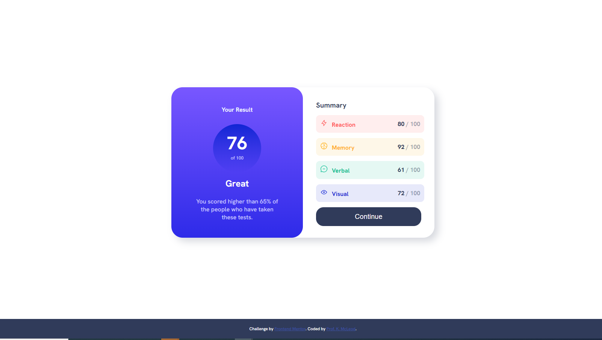
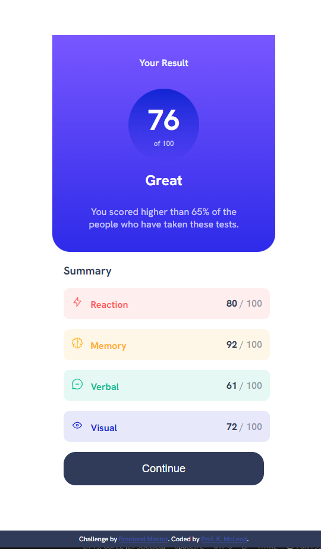

# Frontend Mentor - Results summary component solution

This is a solution to the [Results summary component challenge on Frontend Mentor](https://www.frontendmentor.io/challenges/results-summary-component-CE_K6s0maV). Frontend Mentor challenges help you improve your coding skills by building realistic projects. 

## Table of contents

- [Overview](#overview)
  - [The challenge](#the-challenge)
  - [Screenshot](#screenshot)
  - [Links](#links)
- [My process](#my-process)
  - [Built with](#built-with)
  - [Continued development](#continued-development)
- [Author](#author)
- [Acknowledgments](#acknowledgments)

## Overview

### The challenge

Users should be able to:

- View the optimal layout for the interface depending on their device's screen size
- See hover and focus states for all interactive elements on the page

### Screenshot

### Links

- [Solution URL](https://www.frontendmentor.io/solutions/css-variables-media-query-S_EyUvxjuQ)
- [Live Site URL](https://profkmcleod.github.io/fm-results-summary-component-main/)

## My process

### Built with

- Semantic HTML5 markup
- CSS custom variables
- Flexbox
- Mobile-first workflow

### Continued development

As with all things web development, practice makes things better. I enjoy seeing alternate approaches as there is no single way to get to the end result. I am so grateful for this community.

## Author

- Frontend Mentor - [@profkmcleod](https://www.frontendmentor.io/profile/profkmcleod)
